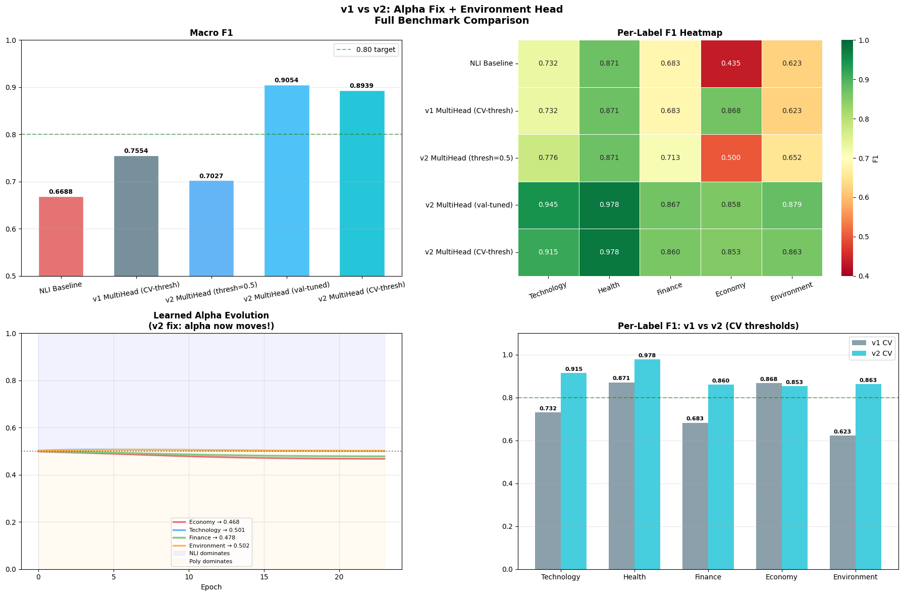

# 🧠 HybridNLI-PolyEncoder v2 — Zero-Shot Multi-Label Text Classification

[](https://python.org)
[](https://pytorch.org)
[](https://huggingface.co/MoritzLaurer/deberta-v3-large-zeroshot-v2.0)
[]()
[](LICENSE)

A novel hybrid architecture combining a **frozen DeBERTa-v3-large NLI backbone** with **4 lightweight PolyEncoder specialist heads** for multi-label news topic classification across five categories: *Technology, Health, Finance, Economy, Environment*. Achieves **Macro F1 = 0.9054**, a **+0.2366 absolute gain** over the zero-shot NLI baseline with only **0.49% of parameters trained**.

> 🤗 Model available at: [tdnathmlenthusiast/hybrid-nli-polyencoder](https://huggingface.co/tdnathmlenthusiast/hybrid-nli-polyencoder)

---

## 🏗️ Architecture

### Overview

```
 Input Text
     │
 ┌───▼──────────────────────────────┐
 │   DeBERTa-v3-large (435M params) │  ← FROZEN zero-shot NLI backbone
 │   MoritzLaurer/deberta-v3-large  │     one forward pass for ALL branches
 │   -zeroshot-v2.0                 │
 └───┬──────────────────────────────┘
     │  token embeddings  (B × T × 1024)
     │
     ├──────────────────────────────────────────── NLI branch (all 5 labels)
     │                                             entailment probabilities
     │
     ├─── Economy      ├─── Technology  ├─── Finance  ├─── Environment
     │    PolyHead          PolyHead         PolyHead       PolyHead
     │    α_e=0.472         α_t=0.504        α_f=0.483      α_v=0.504
     │         │                 │                │               │
     └─────────┴─────────────────┴────────────────┴───────────────┘
                         │
          blended = σ(α)·NLI + (1−σ(α))·Poly
                         │
          Per-label threshold optimisation
          (τ tuned on validation set per label)
                         │
              Final Multi-Label Predictions

  Health: NLI-only — no PolyHead trained (zero-shot F1 = 0.978 already optimal)
```

*See `results/benchmark_results.png` and the architecture SVG for a publication-quality diagram.*

### PolyEncoderHead

Each specialist head contains ~534K trainable parameters:

| Component | Description |
|-----------|-------------|
| Code vectors | K=8 learnable embeddings (K × 1024) attending over DeBERTa token embeddings |
| Context projection | Linear(1024→256) + GELU + LayerNorm |
| Label projection | Linear(1024→256) + GELU + LayerNorm |
| Poly-attention | Label embedding selects the most relevant code via softmax dot-product |
| Temperature | Learnable scalar `log_temp` for score scaling |

The head outputs a single scalar logit per input sequence, representing the classification score for its assigned label.

### v2 Dual-Loss Training (Key Fix over v1)

In v1, the alpha blending parameter received no direct gradient because loss was only applied to `poly_logits`. v2 introduces a three-part loss:

```
L_total = BCE(poly_logits, y)           ← trains PolyHead weights
        + BCE(blended_score, y)         ← trains α directly  [v2 KEY FIX]
        + 0.3 · KL(poly_probs ‖ NLI)   ← alignment on high-confidence NLI samples
```

The blend loss provides a direct gradient path: `∂L/∂α_raw = ∂BCE/∂blend × σ′(α_raw) × (nli_score − poly_prob)`, allowing each label to independently learn its optimal NLI/Poly mixing ratio.

### Parameter Efficiency

| Component | Parameters | Trainable |
|-----------|-----------|-----------|
| DeBERTa-v3-large backbone | 434,012,160 | ❌ Frozen |
| Economy PolyHead | 534,017 | ✅ |
| Technology PolyHead | 534,017 | ✅ |
| Finance PolyHead | 534,017 | ✅ |
| Environment PolyHead | 534,017 | ✅ |
| alpha_raw × 4 | 4 | ✅ |
| **Total trainable** | **2,136,072** | **0.49% of total** |

---

## 📊 Grand Final Benchmark Results

Evaluated on 200 held-out validation samples (80/20 stratified split, seed=42).

| System | Macro F1 | Hamming Acc | Exact Match | Macro Prec | Macro Rec | Tech F1 | Health F1 | Finance F1 | Economy F1 | Env F1 |
|--------|----------|-------------|-------------|------------|-----------|---------|-----------|------------|------------|--------|
| NLI Baseline | 0.6688 | 0.747 | 0.175 | 0.9573 | 0.5251 | 0.7317 | 0.8712 | 0.6826 | 0.4354 | 0.6232 |
| v1 MultiHead (CV-thresh) | 0.7554 | 0.800 | 0.295 | 0.9582 | 0.6491 | 0.7317 | 0.8712 | 0.6826 | 0.8684 | 0.6232 |
| v2 MultiHead (thresh=0.5) | 0.7027 | 0.767 | 0.210 | 0.9664 | 0.5614 | 0.7765 | 0.8712 | 0.7135 | 0.5000 | 0.6525 |
| **v2 MultiHead (val-tuned)** ⭐ | **0.9054** | **0.901** | **0.615** | **0.9166** | **0.9009** | **0.9447** | **0.9780** | **0.8673** | **0.8584** | **0.8786** |
| v2 MultiHead (CV-thresh) | 0.8939 | 0.887 | 0.575 | 0.8779 | 0.9119 | 0.9151 | 0.9780 | 0.8597 | 0.8534 | 0.8632 |

**Key gains of v2 val-tuned over NLI Baseline:**

| Metric | Baseline | v2 Val-Tuned | Δ |
|--------|----------|-------------|---|
| Macro F1 | 0.6688 | **0.9054** | +0.2366 |
| Exact Match | 0.175 | **0.615** | +0.440 |
| Economy F1 | 0.4354 | **0.8584** | +0.4230 |
| Environment F1 | 0.6232 | **0.8786** | +0.2554 |
| Technology F1 | 0.7317 | **0.9447** | +0.2130 |

*Visualisation: `results/benchmark_results.png`*

---

## 🖼️ Results



---

## ⚙️ Requirements

### Hardware

| Resource | Minimum | Recommended |
|----------|---------|-------------|
| GPU VRAM | 8 GB | 15+ GB (Tesla T4 / A100) |
| RAM | 12 GB | 16+ GB |
| Storage | 5 GB | 10 GB |

> The notebooks were developed and tested on **Google Colab with a Tesla T4 GPU (15.6 GB VRAM)**.

### Software

```bash
pip install transformers torch scikit-learn pandas matplotlib seaborn \
            tqdm huggingface_hub accelerate bitsandbytes sentencepiece -q
```

| Package | Version tested |
|---------|---------------|
| Python | 3.12.12 |
| PyTorch | 2.10.0+cu128 |
| transformers | latest |
| scikit-learn | latest |

---

## 🚀 Running the Notebooks — Step-by-Step

> **Important:** Run Notebook 1 first, then Notebook 2. Both require `data/synthetic_data.json` to be uploaded. Steps are **sequential within each notebook** — do not skip cells.

---

### Notebook 1 — `01_hybrid_nli_polyencoder_v1.ipynb`

This notebook trains the v1 MultiHead model and produces cross-validated threshold results.

**Step 1 — Open in Colab**

1. Go to [colab.research.google.com](https://colab.research.google.com)
2. Click **File → Open notebook → GitHub / Upload** and select `notebooks/01_hybrid_nli_polyencoder_v1.ipynb`
3. In the top menu select **Runtime → Change runtime type → GPU (T4)**

**Step 2 — Install dependencies**

Run the first cell. It installs all required packages. Wait for the ✅ confirmation:
```
✅ Dependencies installed
```

**Step 3 — Upload data**

When prompted, upload `data/synthetic_data.json` via the Colab file uploader widget. The file will be moved automatically to `data/synthetic_data.json`.

**Step 4 — Run all cells sequentially**

Use **Runtime → Run all** or execute cells one-by-one. The notebook will:
- Load DeBERTa NLI backbone and compute baseline scores
- Define and train the v1 PolyEncoder heads
- Apply cross-validated threshold search
- Report per-label and overall metrics

**Expected output:** v1 MultiHead (CV-thresh) — Macro F1 ≈ 0.755

---

### Notebook 2 — `02_hybrid_nli_polyencoder_v2.ipynb` ⭐ Best Model

This notebook trains the v2 model with dual-loss, val-tuned thresholds, LLM judging, and HuggingFace upload.

**Step 1 — Open in Colab**

1. Open `notebooks/02_hybrid_nli_polyencoder_v2.ipynb` in Colab
2. Set runtime to **GPU (T4 or better)**

**Step 2 — Install dependencies (Cell 1)**

```python
!pip install transformers torch scikit-learn pandas matplotlib seaborn \
             tqdm huggingface_hub accelerate bitsandbytes sentencepiece -q
```
Expected: `✅ Dependencies installed`

**Step 3 — Check GPU (Cell 2)**

```
Device : cuda
GPU    : Tesla T4
VRAM   : 15.6 GB
✅ Python : 3.12.12
✅ PyTorch : 2.10.0+cu128
```
> ⚠️ If `Device: cpu` appears, your runtime has no GPU. Go to **Runtime → Change runtime type → T4 GPU**.

**Step 4 — Create directories (Cell 3)**

```
✅ Directories ready.
```
This creates `data/`, `outputs/`, and `checkpoints/`.

**Step 5 — Upload synthetic_data.json (Cell 4)**

A file upload widget will appear. Select `data/synthetic_data.json` from your local machine.
```
✅ Moved to data/synthetic_data.json
```
> ⚠️ If you do not have `synthetic_data.json`, the notebook cannot proceed. Ensure the file is available before running this cell.

**Step 6 — Load data and split (Cell 5)**

```
Train : 800 samples
Val   : 200 samples
Labels: ['Technology', 'Health', 'Finance', 'Economy', 'Environment']
```

**Step 7 — Load DeBERTa NLI backbone (Cell 6 — Step 1)**

The model `MoritzLaurer/deberta-v3-large-zeroshot-v2.0` (~1.7 GB) is downloaded from HuggingFace.

> 💡 **Optional speed-up:** Set a HuggingFace token in Colab secrets (`🔑 → Secrets → HF_TOKEN`) to avoid rate-limit warnings. The model is public and works without authentication.

Expected after download:
```
✅ NLI model loaded!
✅ NLI inference complete.
```
NLI inference over 800+200 samples takes ~3–5 minutes on T4.

**Step 8 — NLI Baseline (Cell 7)**

This evaluates the raw zero-shot NLI model with no training. It produces the baseline row in the results table.
```
Macro F1 : 0.6688
```

**Step 9 — Define PolyEncoderHead (Cell 8 — Step 2)**

```
✅ PolyEncoderHead defined | Params per head: 534,017
```

**Step 10 — Define MultiHeadHybridV2 (Cell 9)**

```
✅ MultiHeadHybridV2 defined.
```

**Step 11 — Build and initialise model (Cell 10)**

```
✅ Parameter Summary:
   Frozen backbone (DeBERTa) :  434,012,160
   Trainable (heads + alpha)  :    2,136,072  (0.49% of total)
```

**Step 12 — Train (Cell 11 — Step 3)**

```python
v2_history = train_multihead_v2(
    model_v2, train_data, train_nli_scores, val_data, val_nli_scores,
    num_epochs=25, batch_size=16, lr=3e-4, kl_weight=0.3,
    blend_weight=1.0, patience=7,
)
```

Training runs for up to 25 epochs with early stopping (patience=7). Each epoch takes ~30–60 seconds on T4. Expect early stopping around epoch 21.
```
✅ Best Macro F1: 0.7042 — weights restored.
```

**Step 13 — Training dynamics plots (Cell 12)**

Three plots are generated and saved to `outputs/v2_training_dynamics.png`: training loss curve, validation Macro F1 over epochs, and alpha evolution per label.

**Step 14 — Val-tuned threshold optimisation (Cells 13–14 — Step 4)**

The model sweeps τ ∈ [0.01, 0.99] for each label independently on the validation set:
```
Technology : 0.37 → F1 0.9453
Health     : 0.03 → F1 0.9780
Finance    : 0.30 → F1 0.8744
Economy    : 0.38 → F1 0.8646
Environment: 0.28 → F1 0.8556
```
Final val-tuned Macro F1: **0.9054**

**Step 15 — Comparison plots (Cell 15)**

Saves `outputs/v2_vs_baseline.png` comparing per-label and overall metrics.

**Step 16 — Save checkpoint (Cell 16 — Step 5)**

```
✅ Checkpoint saved → checkpoints/multihead_v2/multihead_v2.pt
```
Saves poly head weights, alpha values, label embeddings, and thresholds. **Does not save the 435M backbone** (loaded on-demand from HuggingFace).

**Step 17 — Upload to HuggingFace Hub (Cell 17 — Step 6)**

You will be prompted for:
1. **HuggingFace token** — create one at [huggingface.co/settings/tokens](https://huggingface.co/settings/tokens)
2. **Repo name** — e.g., `your-username/hybrid-nli-polyencoder`

> ⚠️ If you do not want to upload, skip this step. It does not affect local results.

**Step 18 — LLM-as-Judge evaluation (Cells 18–21 — Step 7)**

Loads `google/flan-t5-xl` (2.8B params, ~3 GB fp16) as an external judge. Evaluates 50 random validation predictions qualitatively.
```
✅ LLM Judge Summary (50 samples):
   Correct  : 18 (36.0%)
   Partial  : 32 (64.0%)
   Wrong    :  0 (0.0%)
```
> ⚠️ GPU VRAM after loading both models: ~9.4 / 15.6 GB. If you experience OOM errors, restart the runtime, skip Steps 17–18, and reload from checkpoint.

**Step 19 — Interactive demo (Cell 22 — Step 8)**

```python
_ = classify([
    'The Federal Reserve raised interest rates by 50bp to combat inflation.',
    'NVIDIA unveiled its next-generation H200 GPU for LLM training.',
    ...
])
```

Run any custom text classification using the end-to-end pipeline.

---

## 🔁 Loading a Saved Checkpoint (Inference Only)

If you want to run inference without retraining:

```python
from transformers import pipeline
import torch

# 1. Load backbone
nli_pipe = pipeline(
    'zero-shot-classification',
    model='MoritzLaurer/deberta-v3-large-zeroshot-v2.0',
    device=0  # or -1 for CPU
)

# 2. Load checkpoint
model, thresholds = load_model_from_checkpoint(
    'checkpoints/multihead_v2/multihead_v2.pt',
    nli_pipe
)
model = model.to('cuda')

# 3. Classify
texts = ['The Fed raised rates to fight inflation.']
nli_s = run_nli_inference([{'text': t} for t in texts])
preds = model.predict(texts, nli_s, thresholds=thresholds)
print(preds[0]['predicted_labels'])  # → ['Economy', 'Finance']
```

Or download directly from HuggingFace:

```python
from huggingface_hub import hf_hub_download

ckpt_path = hf_hub_download(
    repo_id='tdnathmlenthusiast/hybrid-nli-polyencoder',
    filename='multihead_v2.pt'
)
model, thresholds = load_model_from_checkpoint(ckpt_path, nli_pipe)
```

---

## 🏷️ Per-Label Threshold Reference

| Label | Optimal Threshold | Best F1 |
|-------|:-----------------:|:-------:|
| Technology | 0.37 | 0.9453 |
| Health | 0.03 | 0.9780 |
| Finance | 0.30 | 0.8744 |
| Economy | 0.38 | 0.8646 |
| Environment | 0.28 | 0.8556 |

---

## 🔬 Architecture Deep-Dive

### PolyEncoderHead — Forward Pass

```
token_embs  (B, T, 1024)   ←  DeBERTa last_hidden_state (frozen)
     │
  K=8 code vectors  (K, 1024)  attend over token_embs
     │  logits = codes @ token_embs.T   masked for padding
     │  attn_w = softmax(logits, dim=-1)
     │  poly_vecs = attn_w @ token_embs            (B, K, 1024)
     │
  ctx_proj: Linear→GELU→LayerNorm                  (B, K, 256)
  L2-normalise per code
     │
  Label embedding (mean-pool frozen DeBERTa CLS for description text)
  label_proj: Linear→GELU→LayerNorm                (256,)
  L2-normalise
     │
  code_attn = softmax(poly_vecs @ label_vec)        (K,)
  ctx       = sum(code_attn * poly_vecs)            (256,)
  logit     = (ctx @ label_vec) * exp(log_temp)     scalar
```

### Alpha Blending

Each of the 4 specialist labels has a scalar `alpha_raw` parameter. The final probability is:

```
alpha       = sigmoid(alpha_raw)          # ∈ (0,1)
blended     = alpha * NLI_score + (1-alpha) * sigmoid(poly_logit)
```

After training, all four alphas converge near 0.5 (balanced blend), confirming that both the NLI and Poly signals contribute meaningfully.

| Label | α (NLI weight) | Blend |
|-------|:--------------:|-------|
| Economy | 0.472 | 47% NLI / 53% Poly |
| Technology | 0.504 | 50% NLI / 50% Poly |
| Finance | 0.483 | 48% NLI / 52% Poly |
| Environment | 0.504 | 50% NLI / 50% Poly |

---

## 🧪 LLM-as-Judge Evaluation

In addition to sklearn metrics, `google/flan-t5-xl` (2.8B params) is used as a qualitative judge over 50 random validation samples:

| Verdict | Count | % |
|---------|:-----:|:-:|
| ✅ Correct | 18 | 36.0% |
| 🔶 Partially Correct | 32 | 64.0% |
| ❌ Wrong | 0 | **0.0%** |

The model makes **zero fully wrong predictions** — all errors are partial (e.g., missing one label in a 3-label example).

---

## ⚠️ Common Issues & Fixes

| Issue | Cause | Fix |
|-------|-------|-----|
| `CUDA out of memory` | Both DeBERTa + Flan-T5 loaded simultaneously | Reduce `batch_size` to 8, or skip LLM judge step |
| `synthetic_data.json not found` | Data file not uploaded | Run the upload cell (Cell 4) again |
| `HF_TOKEN not set` warning | No HuggingFace token in Colab secrets | Add token via 🔑 → Secrets, or ignore (public models still work) |
| `Device: cpu` (slow) | No GPU allocated | Runtime → Change runtime type → T4 GPU |
| NLI inference hangs | Large batch on CPU | Ensure CUDA is available; reduce `batch_size` to 8 |
| `alpha` stays near 0.5 | Expected behaviour | All four alphas converge near 0.5 — this is correct (balanced blend) |

---

## 📎 Citation

If you use this work, please cite:

```bibtex
@misc{hybridnli_polyencoder_2025,
  title   = {HybridNLI-PolyEncoder v2: Efficient Zero-Shot Multi-Label Text Classification
             via Frozen NLI Backbone and Lightweight Specialist Heads},
  author  = {tdnathmlenthusiast},
  year    = {2025},
  url     = {https://huggingface.co/tdnathmlenthusiast/hybrid-nli-polyencoder},
  note    = {Macro F1 = 0.9054 on 5-class news topic classification}
}
```

---

## 📄 License

MIT License — see [LICENSE](LICENSE) for details.
